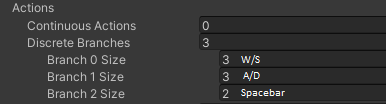
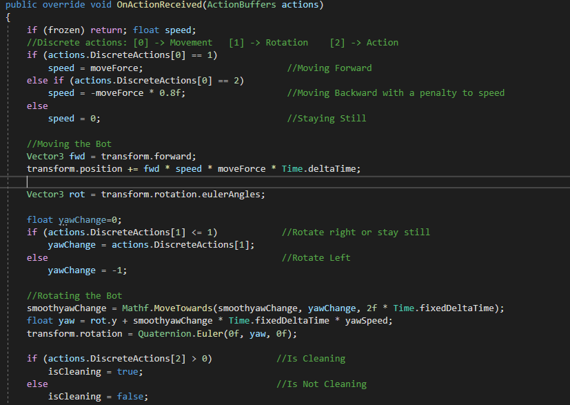

# ML-Agents

This repository is used to expose some of the work developed in my thesis in 3D Sensing Character Simulation using Game Engine Physics, where I used the Unity game engine and the ML-Agents Plugin to teach bots how to play several games using reinforcement learning and imitation learning techniques.

## Example Games

### Clean the Bush

In this game the player is presented with a field full of polluted purple bushes. The player's objective is to walk though the field and clean these polluted bushes until they turn green. Besides the polluted bushes, the field also has some rocks and fallen trunks that serve as obstacles the player must avoid.

### Carry the Box

In this cooperative game the players have to work in two different zones to deliver boxes to a carriage. The first player has to carry the boxes from spawn to a ramp, which delivers the boxes for the second player to deliver to the carriage.

### Capture the Flag

In this competitive game, 2 teams of 3 players compete to steal the opposition flag and return it to home field. To aid this, the players can pick up balls from the field and throw it against opponents to stun them for a short duration and make them drop any flags they are carrying.

## How to train bot with ML-Agents

The ML-Agents plugin has 2 componets that are needed to teach bots how to play games. The first one is the unity package that supplies the editor with all the scripts and classes that are needed to create bots and environments for the simulations. The second one is the Python plugin which has all the algorithms tha can be used and is responsible with running all the simulation calculations. Tutorials in how to install the ML-Agents can be accessed in the [ML-Agents](https://github.com/miyamotok0105/unity-ml-agents/tree/master/docs) github page.

To create bots that are able to move and learn through ML-Agents command, we need to attatch the bot's Game Object with a script that inheriths the Agent class from the plugin. This can be done in the movement script that bots need. Then, in order for bots to receive input from the simulation, we need to create our implementation from the OnActionReceived funcion from the Agent class, were we define every momement and action the bot can perform. To do this, first, we take every type of action the bot can perform and branch it to an array of values that define which action of its type the bot should perform. 

In the Clean the Bush game we branched the actions into 3 discrete values as seen in the image above. The first one defines the bot movement, as it can move forward, backward or stay still (atributed the values 1, 2 and 0 respectively). The second branch describes rotation, as the bot can rotate left, right or not rotate (atributed the values 2, 1 and 0 respectively). Lastly, we have the branch that defines if the bot is doing its action of cleaning. With the branches defined, we can now decribe all movement in the OnActionReceived function. This function receives as input from the simulation an Action Buffer. With this buffer we receive the values from each branch and with it code each movement as it should. In the image bellow, it is shown a sample code snippet used to code the movements for the Clean the Bush game.

