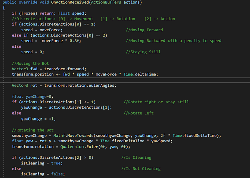

# ML-Agents

This repository is used to expose some of the work developed in my thesis in 3D Sensing Character Simulation using Game Engine Physics, where I used the Unity game engine and the ML-Agents Plugin to teach bots how to play several games using reinforcement learning and imitation learning techniques.

## Example Games

### Clean the Bush

In this game the player is presented with a field full of polluted purple bushes. The player's objective is to walk though the field and clean these polluted bushes until they turn green. Besides the polluted bushes, the field also has some rocks and fallen trunks that serve as obstacles the player must avoid.

### Carry the Box

In this cooperative game the players have to work in two different zones to deliver boxes to a carriage. The first player has to carry the boxes from spawn to a ramp, which delivers the boxes for the second player to deliver to the carriage.

### Capture the Flag

In this competitive game, 2 teams of 3 players compete to steal the opposition flag and return it to home field. To aid this, the players can pick up balls from the field and throw it against opponents to stun them for a short duration and make them drop any flags they are carrying.

## How to train bot with ML-Agents

The ML-Agents plugin has 2 componets that are needed to teach bots how to play games. The first one is the unity package that supplies the editor with all the scripts and classes that are needed to create bots and environments for the simulations. The second one is the Python plugin which has all the algorithms tha can be used and is responsible with running all the simulation calculations. Tutorials in how to install the ML-Agents can be accessed in the [ML-Agents](https://github.com/miyamotok0105/unity-ml-agents/tree/master/docs) github page.

To create bots that are able to move and learn through ML-Agents command, we need to attatch the bot's Game Object with a script that inheriths the Agent class from the plugin. This can be done in the movement script that bots need. Then, in order for bots to receive input from the simulation, we need to create our implementation from the OnActionReceived funcion from the Agent class, were we define every momement and action the bot can perform. To do this, first, we take every type of action the bot can perform and branch it to an array of values that define which action of its type the bot should perform. 

In the Clean the Bush game we branched the actions into 3 discrete values as seen in the image above. The first one defines the bot movement, as it can move forward, backward or stay still (atributed the values 1, 2 and 0 respectively). The second branch describes rotation, as the bot can rotate left, right or not rotate (atributed the values 2, 1 and 0 respectively). Lastly, we have the branch that defines if the bot is doing its action of cleaning. With the branches defined, we can now decribe all movement in the OnActionReceived function. This function receives as input from the simulation an Action Buffer. With this buffer we receive the values from each branch and with it code each movement as it should. In the image bellow, it is shown a sample code snippet used to code the movements for the Clean the Bush game.

Now our bots can move by command of the simulation, but the simmulation also needs input from the bots so the algotithm can learn how to behave. These inputs are called observations, and are a represetation of everything the bot knows at a given time, such as what the bot sees, touches and intrinsic knowledge the bot can have. For vision, the ML-Agents plugin has a configurable script that can be attached to the bot which simulates vision through ray cast and automatically sends it to the algorithms as observations. For the knowledge the bot should have, the agent class has another function we can implement which is the CollectObservations. In this function we can send values to a Sensor object that will be given to the algorithm. As these values are always given in the same order, the algorithm can start seeing patterns in the observation changes when actions are performed, and see in which states rewards are given. In the image bellow it is seen a sample code snipet from the collect observations function.

Then it is important to define the reward system. Rewards is what tells reinforcement learning algorithms what is good and what is bad to do. In traditional agent simulation, the rewards should only be given by completing the game based on the time it took to finish. This means that in Clean the bush the rewards would be given after all bushes were cleaned, in Carry the box after all boxes were carried, and in Capture the flag after one team wins the game. The time influence in rewards encourages the bots to be as fast as possible, and since only the end goal is rewarded, the bot can learn as freely as possible, finding the absolute best way to beat the game as it can, but the learning process becomes quite expensive as a lot of time is required for the bot to learn. Another way to give rewards is to beside the completion of the game, also reward/penalise certain states of the game that lead to victory. In clean the bush, the bot is rewarded for each moment it spends cleaning, and is penalised for colliding with obstacles. This form of rewarding bots limits the bots learning, as it is being directed to a specific solution to beat the game instead of exploring all solutions, but the learning requires less time to achieve good results.

For imitation learning, bots don't need rewards to learn how to play games, instead need demonstrations. A demonstration is obtained by human gameplay and serves as a data structure that maps observations to actions. With this, bots can try to mimic the human actions by finding the observation set that assimilates the closest to the observations the bot has at each moment and perform the actions mapped in the demonstrations. To obtain demonstrations we can attach to the bot the demonstration recorder script and have humans play instead of the bots. For human players to control the bots, we need to implement the Heuristic function from the Agent class. In this function, we can receive input from the player as any player movement function, but instead of the actual movement, we send to the Action Buffers the value corresponding to said movement. Bellow we see a code snippet of the Heuristic function that moves and rotates the bot with human input.

With the bot and the game ready, all that is left is to train the bots. To do this, we can use the [Anaconda](https://www.anaconda.com/) prompt with the ML-Agents environment active and run the mlagents-learn command. This command requires as additional input the configurations yaml file, which defines the algorithm used and its parameters, and the run id. An example of the command would be "mlagents-learn ./trainer-config.yaml --run-id=simulation01". To understand better how to use the configuration file to select the algorithm, and tune the parameters of the simulation, see the [ML-Agents training guide](https://github.com/gzrjzcx/ML-agents/blob/master/docs/Training-ML-Agents.md). A sample configuration file can be found in the root of the [Clean the Bush](/Executables/Clean%20the%20Bush_RL/), and [Carry the Box](/Executables/Carry%20the%20Box_RL/) games trained with reinforcement learning, in the Examples folder.

## Aditional Content

[Example](/Example/): An example unity project of the Clean the Bush game, with a bot ready to train with the ML-Agents plugin.

[Executables](/Executables/): Example of the games. In this directory is is available the Clean the Bush and Carry the Box games played by bots trained with reinforcement learning, and the capture the flag game as a multiplayer game to be played by 6 players to obtain demonstrations for imitation learning.

[Thesis](/Thesis/): Full version of my thesis.

## Disclaimers

This repository is meant as an introduction of the work of my thesis "3D Sensing Character Simulation using Game Engine Physics" and not as a full fledged tutorial in how to use the ML-Agents plugin. For better material in how to use the plugin access the [ML-Agents](https://github.com/Unity-Technologies/ml-agents) repository.

The work of this thesis was used to publish the paper "Character Simulation Using Imitation Learning With Game Engine Physics" at the [ICGI 2022](https://gpcg.pt/icgi2022/) conference.

For any questions or requests related to this work can be sent to my email jfpe.rodrigues@campus.fct.unl.pt
